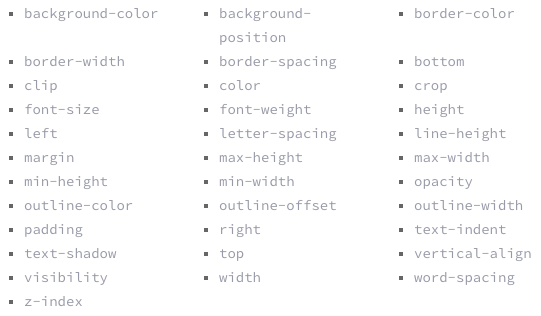
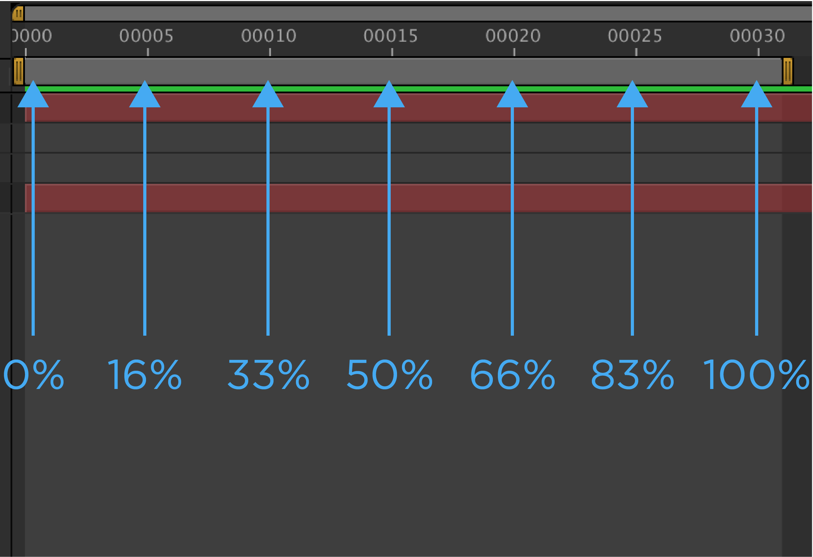
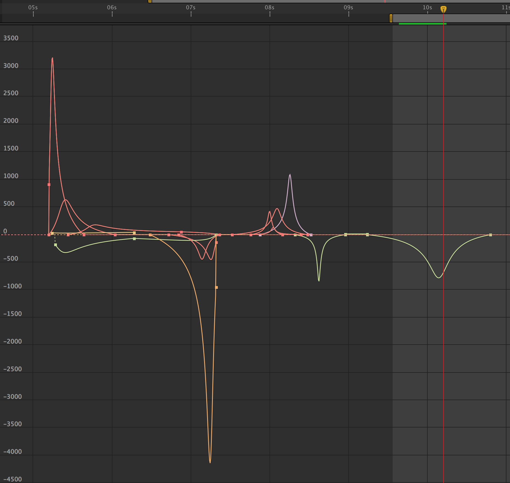
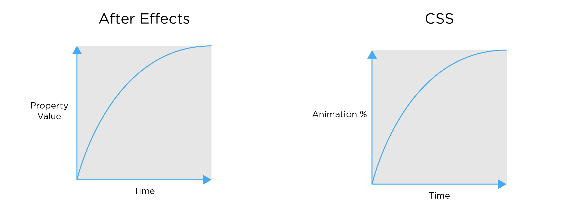

#AE to CSS
##Making the transition from animating in After Effects to CSS.

I started my dive into software design a couple years ago by creating demo videos and animating user interfaces. Coming from a Motion Design background, After Effects was my baby, and I had spent many years perfecting that craft. I have worked side by side with developers recreating the animations that I had created in After Effects. This process was slow and tedious - there was a need for the designer and developer to sit next to each other and hash out the details. I wanted to improve this workflow, so I dove into the research to understand how animations work within development and what the mental model was in which I needed to adapt to. After Effects was my baby but I needed to let it go and understand the new tools at my disposal. Here are some of the key findings I found that an After Effects motion designer needs to understand if their animations will ultimately be in code.

##1. Understand the Limitations
The world of development is constantly changing. As an animator, one needs to be up to date on the current web standards and restrictions for animations.

###Understand the Properties at your disposal.
Basic List of Animatable Properties: 

[Examples of Each Property Animated](http://leaverou.github.io/animatable/)

###Consider Performance.
In After Effects you have to consider the render time of your animations. You have to do the same for code - you have to think about the performance of an animations.

Properties that are performat:

* Position
* Scale
* Rotation
* Opacity

Here is a great article by Paul Lewis and Paul Irish about [High Performance Animations.](
http://www.html5rocks.com/en/tutorials/speed/high-performance-animations/)

###Push the limits:

Explore and see what other cool things are possible with animations! One of my biggest finds was SVG Animations.

#####Things you can do with SVG animation:
* Animate on Path
* Trim Stroke
* Change Stroke Weight
* Color
* SVG Filters

Here is a guide CSS-Tricks created for [SVG Animations!](http://css-tricks.com/guide-svg-animations-smil/)

[I mean check this out!](http://codepen.io/lbebber/pen/RNgBPP?editors=110)

##2. Understand CSS Keyframe Animation Structure

First define the keyframes for the animation:

	@keyframes animation-rocks {
	  0% {
	    font-size: 10px;
	  }
	  30% {
	    font-size: 15px;
	  }
	  100% {
	    font-size: 12px;
	  }
	}
	
Then apply those keyframes to the object(s). Here additional animation properties can be defined for example: duration, iteration, delay, etc.

	.object-class {
	 animation-name: animation-rocks;
	 animation-duration: 4s;
	 animation-iteration-count: 10;
	 animation-direction: alternate;
	 animation-timing-function: ease-out;
	 animation-fill-mode: forwards;
	 animation-delay: 2s;
	}

For more information about the CSS Keyframe animation structure check out [W3School's CSS3 Animations](http://www.w3schools.com/css/css3_animations.asp)

##3. Thinking in Percentages vs. Frames

Animations are thought of as a 0% - 100% in the world of development vs. seconds/frames in After Effects. As an animator you need to be able to calculate where keyframes are located within a perecentage vs. the frame/timecode its on. 

The best way to prepare for this calculation in After Effects is to animate with a timeline that ends with a multiple of 5 (Ex: 30 frames or 1 second) - this makes it easier to translate your animation into code. It is also helpful to align multiple animation properties to the same percentage in the timeline. Below is an example of percentages mapped out to an After Effects timeline.

##4. Understanding The Motion Curves of Timing-Functions

Understanding Timing-Functions was the trickest part for me to wrap my mind around. Within CSS & many other programing languages there are [predefined easing curves.](http://easings.net/) The standard `easeIn`, `easeOut`, `easeOutBounce`, etc. As an advanced animator, we never want to settle for a standard easy-ease - we like to get fancy and smooth with our easing curves. An average graph editor in After Effects looks like this:

So how do we recreate these beautiful motion curves in code? This is where the power of the `cubic-bezier()` comes in.

The `cubic-bezier()` function can be manipulated however you want - just like the After Effects graph editor. The only difference is the X&Y axies. 

After Effects is Property over Time. The CSS `cubic-bezier()` is Percent of Animation over Time.

Adabting to this mental model took some time. Below is a visual examples of how After Effects curves translate to code.

Below shows how the timeline above would look in CSS. Curve A & B are custom `cubic-bezier()` created with tools like [Ceasar](http://matthewlein.com/ceaser/) or [Cubic-Bezier.com](http://cubic-bezier.com/).

	@keyframes ae-to-css {
	  0% {
	    animation-timing-function:ease-out;
	  }
	  23% {
	    animation-timing-function:ease-in;
	  }
	  50% {
	    animation-timing-function:cubic-bezier(.5,0,.5,1.5);
	  }
	  76% {
	    animation-timing-function:cubic-bezier(0,0,0,1);
	  }
	  100% {
	  }
	}

##5. Understanding the possible changing variables -

When designing animation for interaction, it's important to consider that variables do change based on user input. The most common variable that requires flexibility is the `animation-duration()` - this is the amount of time that the animation takes to complete.

The way I prototype this in After Effects is by expanding or contracting a group of keyframes. You can do this by selecting all the keyframes then hold Alt(Windows) or Option (Mac OS) and drag the first or last keyframe to the desired time. This mimics the possible changing time variable within code.

####My process for translating a basic animations into code:

* Map out the keyframes in percentages:
* Map out easing curves between keyframes:
* Map out time the animation takes:
* Done you have an coded animation!

Resources: 

 [AE Docs - Moving Keyframes](https://helpx.adobe.com/after-effects/using/editing-moving-copying-keyframes.html#move_keyframes_in_time)
 
[Timing Functions](http://www.smashingmagazine.com/2014/04/15/understanding-css-timing-functions/)

